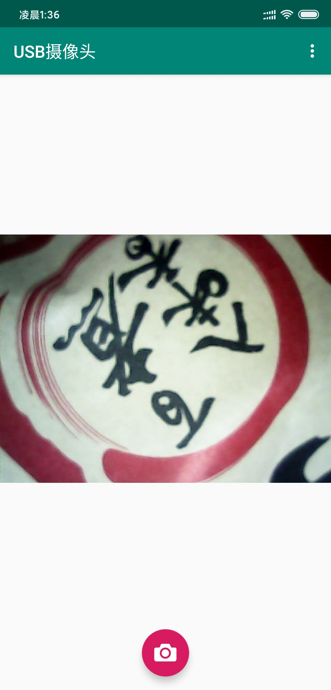

# USBCamera

这是一个USB摄像头APP，基于[UVCCamera](https://github.com/saki4510t/UVCCamera)和[AndroidUSBCamera](https://github.com/jiangdongguo/AndroidUSBCamera)。实现了外接USB摄像头的预览与图片保存功能，同时解决了原项目中一些bug和问题。照片会保存到手机根目录下的USBCamera文件夹下，同时也会保存到相册。

**项目地址:**[USBCamera](https://github.com/shlllshlll/USBCamera)

**下载地址:**[国外地址](https://github.com/shlllshlll/USBCamera/releases/latest)、[国内地址](https://cloud.shlll.top/s/saNgZJS3FSNsQS9)

<p align="center">

</p>

## 更新历史

### V2.0

此版本弃用了[AndroidUSBCamera](https://github.com/jiangdongguo/AndroidUSBCamera)中的UVCCameraHelper类，只保留了[UVCCamera](https://github.com/saki4510t/UVCCamera)中的核心功能，对无关的代码均做了精简。

其中libusbcamera相机库基于[UVCCamera](https://github.com/saki4510t/UVCCamera)，并添加了USBCameraHelper类简化调用。此外去除了原库中与UI相关的代码，去除了AndoridX依赖。提供了USB相机的连接、预览与图片保存接口。

示例APP的基本功能与前一版本相同，但精简了分辨率与对焦两个功能。


### V1.0

此版本基于[AndroidUSBCamera](https://github.com/jiangdongguo/AndroidUSBCamera)，对代码中的一些问题进行了改正，开发了一个拥有分辨率选择、对焦、预览与拍照等功能的实例APP。

## 使用方法

### 添加libusbcamera库

将项目源码中的libusbcamera库添加到工程中即可，根据不同的依赖，build.gradle可设置为：

**AndroidX依赖**
```java
dependencies {
    implementation fileTree(dir: 'libs', include: ['*.jar'])

    api "com.serenegiant:common:4.1.1"
    testImplementation 'junit:junit:4.12'
    androidTestImplementation 'androidx.test.ext:junit:1.1.0'
    androidTestImplementation 'androidx.test.espresso:espresso-core:3.2.0'
}
```
**AppCompat依赖**
```java
dependencies {
    implementation fileTree(dir: 'libs', include: ['*.jar'])

    api "com.serenegiant:common:2.12.4"
    testImplementation 'junit:junit:4.12'
    androidTestImplementation 'com.android.support.test:runner:1.0.2'
    androidTestImplementation 'com.android.support.test.espresso:espresso-core:3.0.2'
}
```


### 使用方法

在Activity中添加如下代码，同时在Layout中设置对应的TextureView。

```java
private UVCCameraTextureView mUVCCameraView;
private USBCameraHelper mUSBCameraHelper;

@Override
protected void onCreate(Bundle savedInstanceState) {
    super.onCreate(savedInstanceState);
    mUVCCameraView = (UVCCameraTextureView)findViewById(R.id.camera_view);
    mUSBCameraHelper = new USBCameraHelper(this, mUVCCameraView);
}

@Override
protected void onDestroy() {
    mUSBCameraHelper.destory();
    super.onDestroy();
}

@Override
protected void onStart() {
    super.onStart();
    mUSBCameraHelper.start();
}

@Override
protected void onStop() {
    mUSBCameraHelper.stop();
    super.onStop();
}
```

保存图片使用如下的API即可，调用后会自动在手机根目录下创建USBCamera文件夹，并将图片以时间名保存，同时存储到相册中。

```java
mUSBCameraHelper.saveCapturePicture();
```

## 兼容性测试

|    机型    |  系统版本  | 安卓版本  | 是否可用 |                           问题描述                           |
| :--------: | :--------: | :-------: | :------: | :----------------------------------------------------------: |
| 红米Note4x | Lineage16 | Android9 | 是 | 无 |
|   小米8    |   MIUI11   | Android10 |    是    |                              无                              |
|   小米9    |   MIUI11   | Android10 |    是    |                              无                              |
|  荣耀Note10  |  EMUI9.1   | Android9  |    是    |                              无                              |
|   荣耀V9   |  EMUI9.1   | Android9  |    是    |                              无                              |
|  荣耀V10   |  EMUI9.1   | Android9  |    是    |                              无                              |
|  荣耀V20   | MagicUI2.1 | Android9  |    是    |                              无                              |
| 荣耀Magic2 | MagicUI2.1 | Android9 | 是 | 无 |
| 华为MateS  |  EMUI4.0   | Android6  |    否    | 可检测到摄像头插入，但点击连接后无显示。调试后发现调用SO库时报错，暂未定位到问题 |
| 华为Mate30 |  EMUI10.0  | Android10 |    是    |                              无                              |
|   华为M3   | EMUI5.0.4  | Android7  |    是    |                              无                              |
| 一加6T | - | Android9 | 是 | 无 |
| VIVO X21i | FuntouchOS | Android9 | 否 | 在设置选项中打开OTG后可检测到摄像头，可正确获取分辨率设置，但无画面显示 |
| VIVO X23 | FuntouchOS | Android9 | 是 | 需要在设置内找到OTG选项并打开 |

## 解决的问题

1. **在部分Android9以上版本无法使用**

此问题是由于Android9中部分设备的UVC摄像头的ID等信息发生了变化，原作者在源码中已修复此问题。

2. **需要手动选择USB设备才可使用**

目前构建的APP，可自动寻找USB摄像头并打开。

3. **Android9中在程序运行时拔出摄像头会导致程序崩溃**

根据Github Pull Request [#454](https://github.com/saki4510t/UVCCamera/pull/454)，重新编译后问题已解决。

4. **JNI库中存在的内存泄露问题**

根据Github Issue [#259](https://github.com/saki4510t/UVCCamera/issues/259)已修改SO库中的空指针错误，重新编译后问题已解决。

5. **解决新版NDK对ABI支持的变动导致JNI编译失败的问题**
6. **将项目迁移到AndroidX**
7. **解决Issues [#244](https://github.com/saki4510t/UVCCamera/issues/244)**

## 注意事项

1. 目前编译的目标SDK版本不能超过27，否则会无法正确获取USB摄像头权限，此问题是由于Android9的API特性更改导致的。如果需要支持，可能需要较多修改。
可参考Pull Request [#480](https://github.com/saki4510t/UVCCamera/pull/480)
